# ArtifexPro Studio - 하이엔드 상업용 영상 생성/편집 플랫폼 설계서

## 🎯 제품 비전
**"AI 영상 생성과 노드 기반 편집의 완벽한 융합"**
- Adobe Premiere Pro + DaVinci Resolve + Runway Gen3를 뛰어넘는 통합 솔루션
- 온디바이스 우선, 클라우드 선택형 하이브리드 아키텍처
- 프로슈머/스튜디오급 상업용 제품

## 🏗️ 핵심 아키텍처

### 1. 시스템 아키텍처 (3-Tier + Node System)

```
┌─────────────────────────────────────────────────────────────┐
│                    Presentation Layer                       │
│  ┌──────────────┐ ┌──────────────┐ ┌──────────────┐       │
│  │   Timeline   │ │ Node Editor  │ │  AI Studio   │       │
│  │   (NLE)      │ │  (Fusion)    │ │  (Wan2.2)    │       │
│  └──────────────┘ └──────────────┘ └──────────────┘       │
└─────────────────────────────────────────────────────────────┘
                               │
┌─────────────────────────────────────────────────────────────┐
│                    Application Layer                        │
│  ┌────────────────────────────────────────────────────┐    │
│  │            Node Graph Engine (NGE)                 │    │
│  │  ┌──────┐ ┌──────┐ ┌──────┐ ┌──────┐ ┌──────┐   │    │
│  │  │Input │→│Process│→│Effect│→│Grade │→│Output│   │    │
│  │  │Nodes │ │ Nodes │ │Nodes │ │Nodes │ │Nodes │   │    │
│  │  └──────┘ └──────┘ └──────┘ └──────┘ └──────┘   │    │
│  └────────────────────────────────────────────────────┘    │
│  ┌────────────────────────────────────────────────────┐    │
│  │          Wan2.2 Integration Service                │    │
│  │  T2V │ I2V │ TI2V │ S2V │ Style Transfer          │    │
│  └────────────────────────────────────────────────────┘    │
└─────────────────────────────────────────────────────────────┘
                               │
┌─────────────────────────────────────────────────────────────┐
│                     Infrastructure Layer                    │
│  ┌──────────┐ ┌──────────┐ ┌──────────┐ ┌──────────┐     │
│  │  GPU     │ │  Cache   │ │  Queue   │ │  Storage │     │
│  │ Manager  │ │  System  │ │  Manager │ │  Engine  │     │
│  └──────────┘ └──────────┘ └──────────┘ └──────────┘     │
└─────────────────────────────────────────────────────────────┘
```

### 2. Node-Based 편집 시스템 (핵심 혁신)

#### 2.1 노드 카테고리 및 기능

```yaml
Input Nodes:
  - MediaInput: 비디오/이미지/오디오 파일 입력
  - CameraInput: 실시간 카메라 피드
  - SequenceInput: 이미지 시퀀스
  - TextInput: 텍스트/자막 입력
  - AudioInput: 오디오 트랙 입력
  - TimelineClip: 타임라인 클립 참조

Generator Nodes (Wan2.2):
  - T2VGenerator: Text-to-Video 생성
    - inputs: [text_prompt, style_preset, parameters]
    - outputs: [video_stream]
  - I2VGenerator: Image-to-Video 생성
    - inputs: [image, prompt, motion_guide]
    - outputs: [video_stream]
  - TI2VGenerator: Text+Image-to-Video
    - inputs: [text, image, parameters]
    - outputs: [video_stream]
  - S2VGenerator: Speech-to-Video
    - inputs: [audio, reference_image, pose_video]
    - outputs: [video_stream]

Process Nodes:
  - MotionTracker: 모션 트래킹
  - Stabilizer: 영상 안정화
  - TemporalDenoise: 시간축 노이즈 제거
  - Upscaler: AI 업스케일링
  - FrameInterpolation: 프레임 보간
  - SpeedRamp: 속도 램핑
  - TimeRemap: 시간 재매핑

Effect Nodes:
  - ChromaKey: 그린스크린 제거
  - Blur: 블러 효과 (Gaussian, Motion, Radial)
  - Glow: 글로우/블룸 효과
  - LensFlare: 렌즈 플레어
  - Particles: 파티클 시스템
  - Distortion: 왜곡 효과
  - Transition: 트랜지션 효과

Color Nodes:
  - ColorCorrector: 기본 색보정
  - ColorWheels: 3-Way 컬러 휠
  - Curves: RGB/Luma 커브
  - LUT: LUT 적용
  - HDRGrading: HDR 그레이딩
  - FilmEmulation: 필름 에뮬레이션
  - ColorSpace: 색공간 변환

Composite Nodes:
  - Merge: 레이어 합성 (Over, Add, Screen, Multiply)
  - Mask: 마스크 생성/적용
  - Roto: 로토스코핑
  - KeyMixer: 키 믹싱
  - AlphaOps: 알파 채널 연산
  - ChannelShuffle: 채널 셔플

Transform Nodes:
  - Transform2D: 2D 변환
  - Transform3D: 3D 변환
  - PerspectiveWarp: 원근 왜곡
  - CornerPin: 코너 핀
  - Crop: 크롭/리사이즈
  - Flip: 플립/미러

Audio Nodes:
  - AudioMixer: 오디오 믹싱
  - AudioEffects: 오디오 이펙트
  - AudioSync: 오디오 동기화
  - VoiceEnhancer: 음성 향상
  - NoiseReduction: 노이즈 감소

Analysis Nodes:
  - SceneDetector: 장면 감지
  - ObjectTracker: 객체 추적
  - FaceDetector: 얼굴 인식
  - AudioAnalyzer: 오디오 분석
  - ColorAnalyzer: 색상 분석

Output Nodes:
  - Viewer: 프리뷰 뷰어
  - FileOutput: 파일 출력
  - StreamOutput: 스트리밍 출력
  - RenderQueue: 렌더 큐 추가
  - TimelineOutput: 타임라인 전송
```

#### 2.2 노드 연결 시스템

```python
class NodeConnection:
    """노드 간 데이터 플로우 정의"""
    
    # 연결 타입
    ConnectionTypes = {
        'VIDEO': VideoStream,      # 비디오 스트림
        'AUDIO': AudioStream,      # 오디오 스트림
        'IMAGE': ImageBuffer,      # 정적 이미지
        'MASK': MaskChannel,       # 알파/마스크
        'DATA': DataPayload,       # 메타데이터
        'CONTROL': ControlSignal   # 제어 신호
    }
    
    # 자동 타입 변환
    AutoConversions = {
        ('IMAGE', 'VIDEO'): ImageToVideoConverter,
        ('VIDEO', 'IMAGE'): ExtractFrameConverter,
        ('MASK', 'IMAGE'): MaskToImageConverter
    }
```

#### 2.3 실시간 프리뷰 파이프라인

```python
class RealTimeNodePreview:
    """GPU 가속 실시간 노드 프리뷰"""
    
    def __init__(self):
        self.preview_resolution = (1920//4, 1080//4)  # 1/4 해상도
        self.cache_strategy = 'adaptive'  # 적응형 캐싱
        self.gpu_scheduler = GPUScheduler()
        
    def process_graph(self, node_graph):
        # 의존성 분석
        execution_order = self.analyze_dependencies(node_graph)
        
        # 병렬 처리 가능 노드 그룹화
        parallel_groups = self.group_parallel_nodes(execution_order)
        
        # GPU 배치 처리
        for group in parallel_groups:
            self.gpu_scheduler.batch_process(group)
            
        return self.collect_outputs()
```

### 3. Wan2.2 통합 최적화

#### 3.1 모델 관리 시스템

```python
class Wan22ModelManager:
    """Wan2.2 모델 라이프사이클 관리"""
    
    def __init__(self):
        self.models = {
            't2v-A14B': None,  # 27B MoE (14B active)
            'i2v-A14B': None,  # 27B MoE
            'ti2v-5B': None,   # 5B Dense
            's2v-14B': None    # 14B
        }
        self.vram_manager = VRAMManager()
        self.cache_dir = Path("models/wan22")
        
    def smart_load(self, task_type, quality_preset):
        """지능형 모델 로딩"""
        required_vram = self.estimate_vram(task_type, quality_preset)
        
        if self.vram_manager.available < required_vram:
            # 자동 오프로드/양자화
            return self.load_with_optimization(task_type, {
                'offload_model': True,
                'convert_dtype': 'bf16',
                't5_cpu': True,
                'use_slicing': True
            })
        
        return self.load_full_precision(task_type)
```

#### 3.2 파이프라인 최적화 프리셋

```yaml
Quality Presets:
  Draft:
    resolution: 480p
    steps: 25
    guide_scale: [2.5, 3.0]
    frame_num: 41
    shift: 3.0
    dtype: fp16
    
  Preview:
    resolution: 720p
    steps: 36
    guide_scale: [3.0, 3.5]
    frame_num: 81
    shift: 4.0
    dtype: bf16
    
  Production:
    resolution: 720p
    steps: 60
    guide_scale: [3.5, 4.5]
    frame_num: 121
    shift: 5.0
    dtype: bf16
    
  Cinema:
    resolution: 1080p (upscaled)
    steps: 80
    guide_scale: [4.0, 5.0]
    frame_num: 241
    shift: 5.0
    dtype: bf16
    post_process: ['denoise', 'sharpen', 'color_grade']

Performance Profiles:
  Speed:
    use_flash_attention: true
    use_xformers: true
    channels_last: true
    torch_compile: true
    sequence_parallel: true
    
  Memory:
    offload_model: true
    cpu_offload_t5: true
    attention_slicing: true
    vae_slicing: true
    gradient_checkpointing: true
    
  Quality:
    use_ema: true
    ensemble_steps: 3
    temporal_consistency: enhanced
    motion_smoothing: true
```

### 4. 고급 기능 시스템

#### 4.1 스마트 프롬프트 시스템

```python
class SmartPromptEngine:
    """다단계 프롬프트 처리 엔진"""
    
    def __init__(self):
        self.prompt_extender = PromptExtender()  # Qwen 기반
        self.style_encoder = StyleEncoder()      # 스타일 인코딩
        self.negative_db = NegativePromptDB()    # 네거티브 DB
        
    def process(self, user_prompt, context):
        # 1. 프롬프트 확장
        extended = self.prompt_extender.extend(
            user_prompt,
            target_length=200,
            style=context.get('style'),
            language=context.get('language', 'en')
        )
        
        # 2. 스타일 주입
        styled = self.style_encoder.inject_style(
            extended,
            style_preset=context.get('preset'),
            strength=context.get('style_strength', 0.7)
        )
        
        # 3. 네거티브 프롬프트 생성
        negative = self.negative_db.generate(
            base_negative=DEFAULT_NEGATIVE,
            context_negative=context.get('avoid', []),
            auto_negative=self.analyze_conflicts(styled)
        )
        
        return styled, negative
```

#### 4.2 멀티 GPU 스케일링

```python
class MultiGPUOrchestrator:
    """멀티 GPU 작업 분배 시스템"""
    
    def __init__(self, gpu_count):
        self.gpu_pool = GPUPool(gpu_count)
        self.strategies = {
            'data_parallel': DataParallelStrategy(),
            'pipeline_parallel': PipelineParallelStrategy(),
            'tensor_parallel': TensorParallelStrategy(),
            'hybrid': HybridParallelStrategy()
        }
        
    def distribute_wan22(self, task, config):
        if config.gpu_count == 1:
            return self.single_gpu_optimize(task)
            
        # Ulysses Attention 분산
        if config.gpu_count <= 8:
            return self.strategies['hybrid'].execute({
                'ulysses_size': config.gpu_count,
                'dit_fsdp': True,
                't5_fsdp': True,
                'sequence_parallel': True
            })
            
        # 대규모 분산 (8+ GPUs)
        return self.strategies['pipeline_parallel'].execute({
            'pipeline_stages': 4,
            'micro_batch_size': 2,
            'gradient_accumulation': 4
        })
```

#### 4.3 실시간 협업 시스템

```python
class CollaborationEngine:
    """실시간 다중 사용자 협업"""
    
    def __init__(self):
        self.session_manager = SessionManager()
        self.conflict_resolver = ConflictResolver()
        self.change_tracker = ChangeTracker()
        
    def sync_node_graph(self, user_id, changes):
        """노드 그래프 실시간 동기화"""
        with self.session_manager.lock(user_id):
            # 충돌 감지
            conflicts = self.conflict_resolver.detect(changes)
            
            if conflicts:
                # 자동 병합 또는 사용자 선택
                resolved = self.conflict_resolver.resolve(
                    conflicts,
                    strategy='auto_merge'
                )
                changes = resolved
                
            # 변경사항 브로드캐스트
            self.broadcast_changes(changes)
            
            # 히스토리 기록
            self.change_tracker.record(user_id, changes)
```

### 5. 프로덕션 파이프라인

#### 5.1 렌더 팜 통합

```yaml
Render Farm:
  Local:
    type: on_premise
    nodes: 
      - {gpu: "RTX 4090", count: 4, vram: 24GB}
      - {gpu: "A100", count: 2, vram: 80GB}
    scheduler: SLURM
    
  Cloud:
    providers:
      - AWS: {instance: "g5.24xlarge", spot: true}
      - Azure: {instance: "NC24ads_A100", reserved: false}
    auto_scale: true
    budget_limit: 1000 USD/month
    
  Hybrid:
    priority: local_first
    overflow_to_cloud: true
    cost_optimizer: enabled
```

#### 5.2 버전 관리 시스템

```python
class ProjectVersionControl:
    """프로젝트 버전 관리"""
    
    def __init__(self, project_path):
        self.vcs = GitLFS(project_path)  # 대용량 파일 지원
        self.metadata_db = SQLite("project.db")
        
    def create_snapshot(self, description):
        """프로젝트 스냅샷 생성"""
        snapshot = {
            'timestamp': datetime.now(),
            'description': description,
            'node_graph': self.serialize_nodes(),
            'assets': self.collect_assets(),
            'settings': self.export_settings(),
            'wan22_seeds': self.preserve_seeds()  # 재현성
        }
        
        return self.vcs.commit(snapshot)
```

### 6. 엔터프라이즈 기능

#### 6.1 권한 관리

```yaml
Role Based Access Control:
  Admin:
    - full_access: true
    - model_management: true
    - user_management: true
    
  Lead_Artist:
    - project_create: true
    - wan22_all_models: true
    - render_priority: high
    - cloud_access: true
    
  Artist:
    - project_edit: true
    - wan22_models: [ti2v-5B]
    - render_priority: normal
    - local_only: true
    
  Reviewer:
    - project_view: true
    - comment: true
    - export: false
```

#### 6.2 자동화 워크플로우

```python
class AutomationWorkflow:
    """프로덕션 자동화"""
    
    def __init__(self):
        self.triggers = {
            'on_import': self.auto_proxy_generation,
            'on_edit': self.auto_save_version,
            'on_render': self.quality_check,
            'on_complete': self.delivery_package
        }
        
    def auto_process_dailies(self, footage_dir):
        """데일리 자동 처리"""
        pipeline = [
            self.import_footage,
            self.generate_proxies,
            self.scene_detection,
            self.auto_color_match,
            self.generate_edit_suggestions,
            self.create_rough_cut
        ]
        
        for step in pipeline:
            yield step(footage_dir)
```

### 7. 성능 벤치마크 목표

```yaml
Performance Targets:
  Generation Speed:
    T2V_720p_5s: < 2 minutes (RTX 4090)
    I2V_720p_5s: < 90 seconds
    TI2V_720p_5s: < 60 seconds (5B model)
    S2V_720p_5s: < 2 minutes
    
  Memory Usage:
    Single_GPU_Min: 24GB VRAM
    Optimal: 48GB VRAM
    Enterprise: 80GB+ VRAM
    
  Quality Metrics:
    Temporal_Consistency: > 0.95
    Motion_Quality: > 0.92
    Aesthetic_Score: > 7.5/10
    User_Satisfaction: > 90%
    
  Scalability:
    Max_Timeline_Tracks: 999
    Max_Node_Graph_Nodes: 10000
    Max_Concurrent_Users: 100
    Max_Project_Size: 10TB
```

### 8. 라이선싱 및 배포

```yaml
Licensing Model:
  Editions:
    Studio:
      price: $299/month or $2999/year
      features: all
      support: priority
      updates: immediate
      
    Professional:
      price: $99/month or $999/year
      features: [T2V, I2V, TI2V-5B, Node Editor]
      support: standard
      updates: monthly
      
    Creator:
      price: $29/month
      features: [TI2V-5B, Basic Nodes]
      render_limit: 100/month
      watermark: false
      
    Trial:
      price: free
      duration: 14 days
      features: all (limited resolution)
      watermark: true
      
  Enterprise:
    pricing: custom
    features: 
      - floating_licenses
      - render_farm_integration
      - custom_training
      - on_premise_deployment
      - SLA_support
```

### 9. 기술 로드맵

```mermaid
graph LR
    Q1[Q1 2025] --> Q2[Q2 2025]
    Q2 --> Q3[Q3 2025]
    Q3 --> Q4[Q4 2025]
    
    Q1 --> M1[v1.0 MVP<br/>- Basic Wan2.2<br/>- Node Editor<br/>- Timeline]
    Q2 --> M2[v1.5 Pro<br/>- All Models<br/>- Cloud Render<br/>- Collaboration]
    Q3 --> M3[v2.0 Enterprise<br/>- Custom Training<br/>- API Platform<br/>- Plugins SDK]
    Q4 --> M4[v2.5 Next Gen<br/>- Real-time Gen<br/>- VR/AR Export<br/>- AI Director]
```



### 10. 차별화 전략

```yaml
Unique Selling Points:
  vs_Adobe_Premiere:
    - Integrated AI generation
    - Node-based compositing
    - No subscription lock-in
    
  vs_DaVinci_Resolve:
    - Wan2.2 AI integration
    - Faster rendering
    - Better timeline-node integration
    
  vs_Runway_Gen3:
    - On-device processing
    - No cloud dependency
    - Full editing suite
    - Source code access (Enterprise)
    
  vs_ComfyUI:
    - Professional UI/UX
    - Timeline integration
    - Commercial support
    - Optimized performance
```

## 결론

ArtifexPro Studio는 Wan2.2의 강력한 AI 영상 생성 능력과 노드 기반 편집의 유연성을 결합하여, 기존 상업용 솔루션들을 뛰어넘는 차세대 영상 제작 플랫폼을 목표로 합니다. 

핵심 성공 요소:
- ✅ 온디바이스 우선 설계로 데이터 보안 및 비용 절감
- ✅ 노드 기반 시스템으로 무한한 확장성
- ✅ Wan2.2 전체 기능 완벽 통합
- ✅ 엔터프라이즈급 협업 및 자동화
- ✅ 투명한 가격 정책 및 영구 라이선스 옵션

이 설계를 바탕으로 단계적 구현을 진행하면, 2025년 내 상업용 출시가 가능할 것으로 예상됩니다.